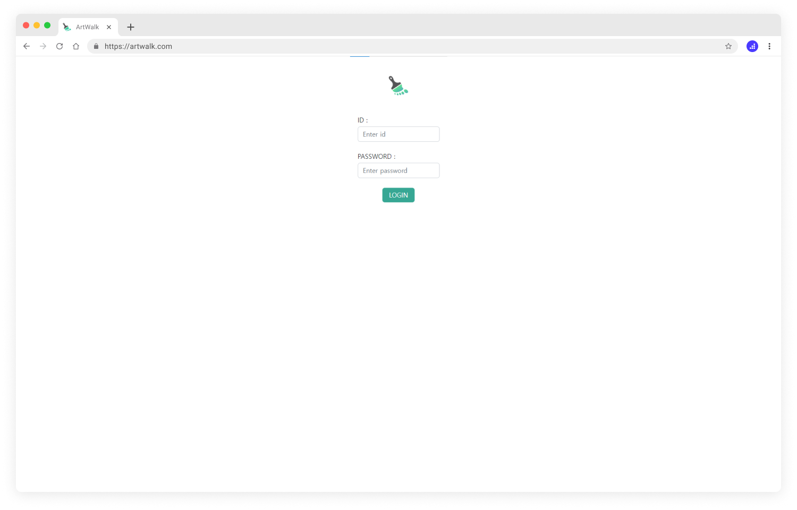
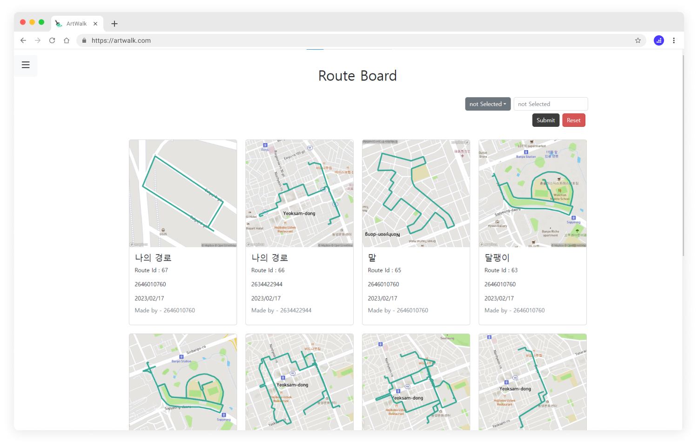
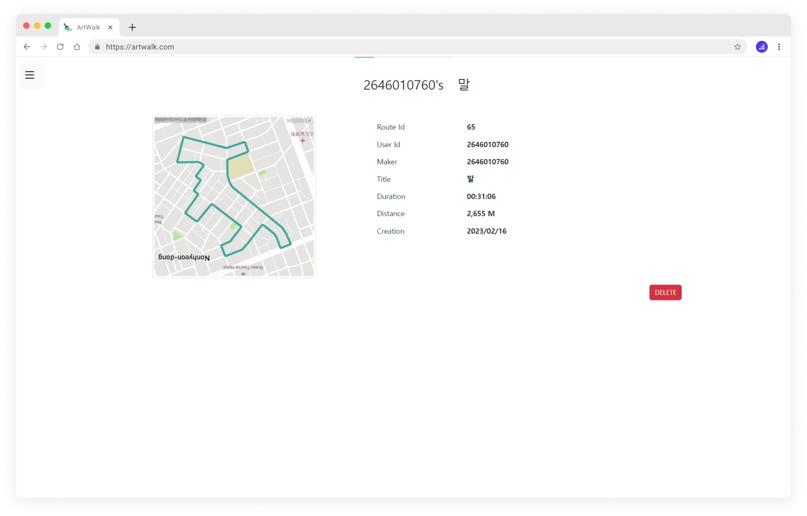
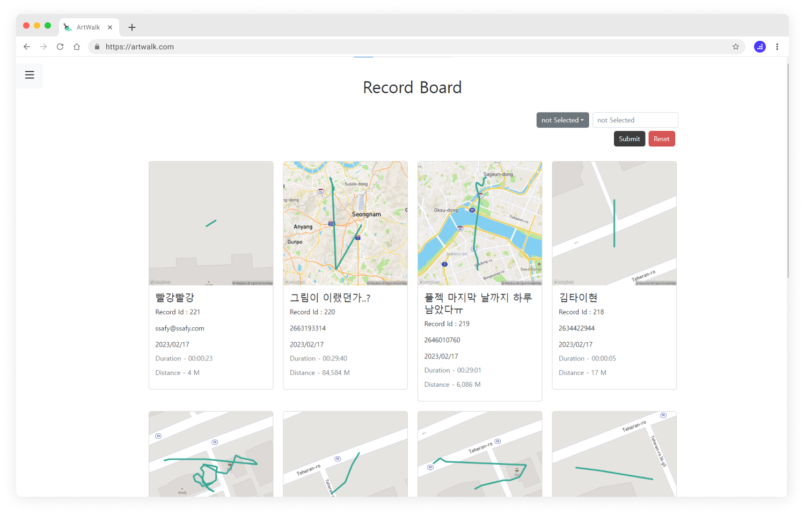
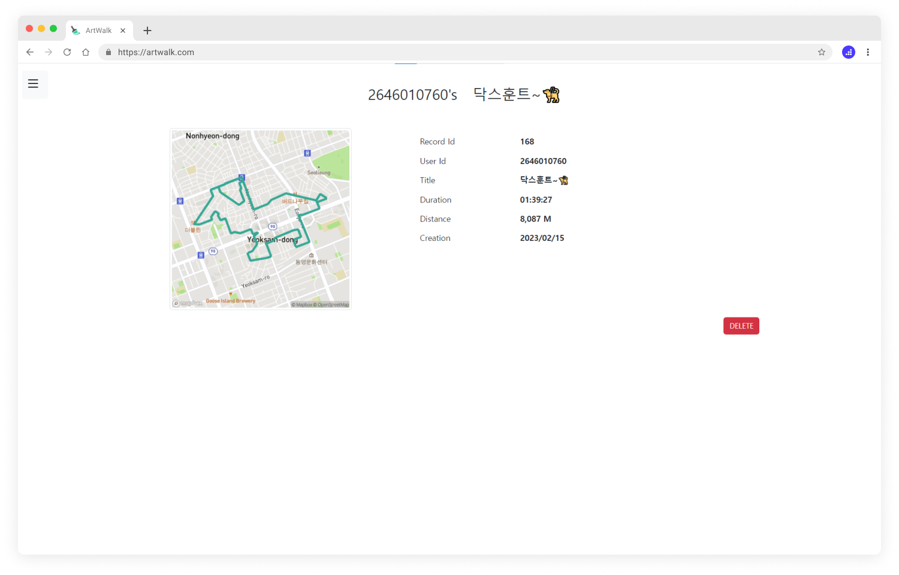
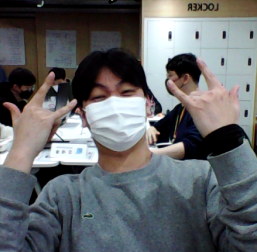

     <h1><b>귿다</b></h1>

 

## 목차

1. [**프로젝트 소개**](#1-프로젝트-소개)
2. [**기술 스택**](#2-기술-스택)
3. [**서비스 화면**](#3-서비스-화면)
4. [**서비스 구성 요소**](#4-서비스-구성-요소)
5. [**기능 소개**](#5-구현-기능)
6. [**개발팀 소개**](#6-개발팀-소개)

 

# **프로젝트 소개**

 

**귿다**는 GPS 트래킹 기록을 이용해 멋진 지도 위 그림을 그릴 수 있는 안드로이드 어플리케이션입니다.

어플리케이션에서 지도 위 원하는 좌표를 선택해 이동하고자 하는 경로의 밑그림을 그릴 수 있습니다.

밑그림을 바탕으로 경로를 따라 이동하고, 저장 및 다른 사용자와 멋진 GPS 아트를 공유할 수 있습니다.

 

👉 ['귿다' 다운로드를 위해 플레이스토어로 이동하기](#https://play.google.com/store/apps/details?id=com.a401.artwalk&pli=1) 👈

 

# ⚙ **기술 스택**

 

### **Android**

| JAVA | Kotlin | Jetpack SDK |
| :---: | :---: | :---: |
|  |  |  |

- Mapbox API
- Android Jetpack
    - Databinding, Navigation, Hilt
- Coroutine / Flow
- MVVM / Clean Architecture
- Retrofit2

 

### **Front-end**

| HTML5 | CSS3 | JavaScript | Vue.js | Node.js |
| :---: | :---: | :---: | :---: | :---: |
|  |  |  |  | |

 

### **Back-end**

| JAVA | Spring-Boot | MySQL | Swagger |
| :---: | :---: | :---: | :---: |
|  |  |  |  |

 

### **DevOps**

| AWS EC2 | NGINX | Jenkins | Docker | Gitlab |
| :---: | :---: | :---: | :---: | :---: |
|  |  |  |  |  |

 

# 🔍 **서비스 화면**

 

 

👉 [애플리케이션 시연 영상 보러가기](#https://youtu.be/0vgKAfpSR84) 👈

 

# 관리자 페이지

 

## 로그인

 

## 메인

 

- 전체 유저, 기록, 경로 데이터를 이용하여 제작된 차트를 확인할 수 있다.

 

## 사이드바

 

- 좌상단에 위치한 버튼을 클릭하여 사이드바를 열고 사이드바를 통해 메인, 회원게시판, 경로게시판, 기록게시판으로 이동할 수 있다.

 

## 유저

 

- 모든 회원의 아이디, 닉네임, 분류, 경로수, 기록수, 가입일, 최근 접속일을 확인 할 수 있다.
- 아이디, 닉네임으로 특정 회원을 검색할 수 있다.
- 상세페이지에서 각 회원의 프로필 이미지와 해당 회원이 작성한 경로, 기록을 추가로 조회하고 삭제할 수 있다.

 

## 경로

 

- 생성된 모든 경로의 썸네일, 타이틀, 경로아이디, 생성한 회원의 아이디, 생성일을 확인 할 수 있다.
- 경로 타이틀, 생성한 회원 아이디로 특정 경로를 검색할 수 있다.
- 상세페이지에서 각 경로의 썸네일, 예상시간, 거리를 추가로 조회하고 해당 경로를 삭제할 수 있다.

 

## 기록

 

- 생성된 모든 기록의 썸네일, 타이틀, 기록아이디, 생성한 회원의 아이디, 생성일을 확인 할 수 있다.
- 기록 타이틀, 생성한 회원 아이디로 특정 기록을 검색할 수 있다.
- 상세페이지에서 각 기록의 썸네일, 소요시간, 거리를 추가로 조회하고 해당 기록을 삭제할 수 있다.

 

# 🧵 **서비스 구성요소**
 

## 아키텍처

 

## ERD 구조

 

# **개발 팀 소개**

 

## 📋**개발 일정**
2023.01.05 ~ 2023.02.17

 

### **Android**
|  |  |
| :---: | :---: |
| 이치헌 | 고은빈 |
| 팀장 | 팀원 |

 

### **Web (Front-end & Back-end)**

|  |  |  |  |
| :---: | :---: | :---: | :---: |
| 공예찬 | 문수빈 | 이창준 | 정유정 |
| 팀원 | 팀원 | 팀원 | 팀원 |

 

<!-- ## 👏 프로젝트 기여

| 이름 | 역할 |
| :---: | :---: |
| 이치헌 | -  |
| 고은빈 | -  |
| 공예찬 | -  |
| 문수빈 | -  |
| 이창준 | -  |
| 정유정 | -  |

 

  -->